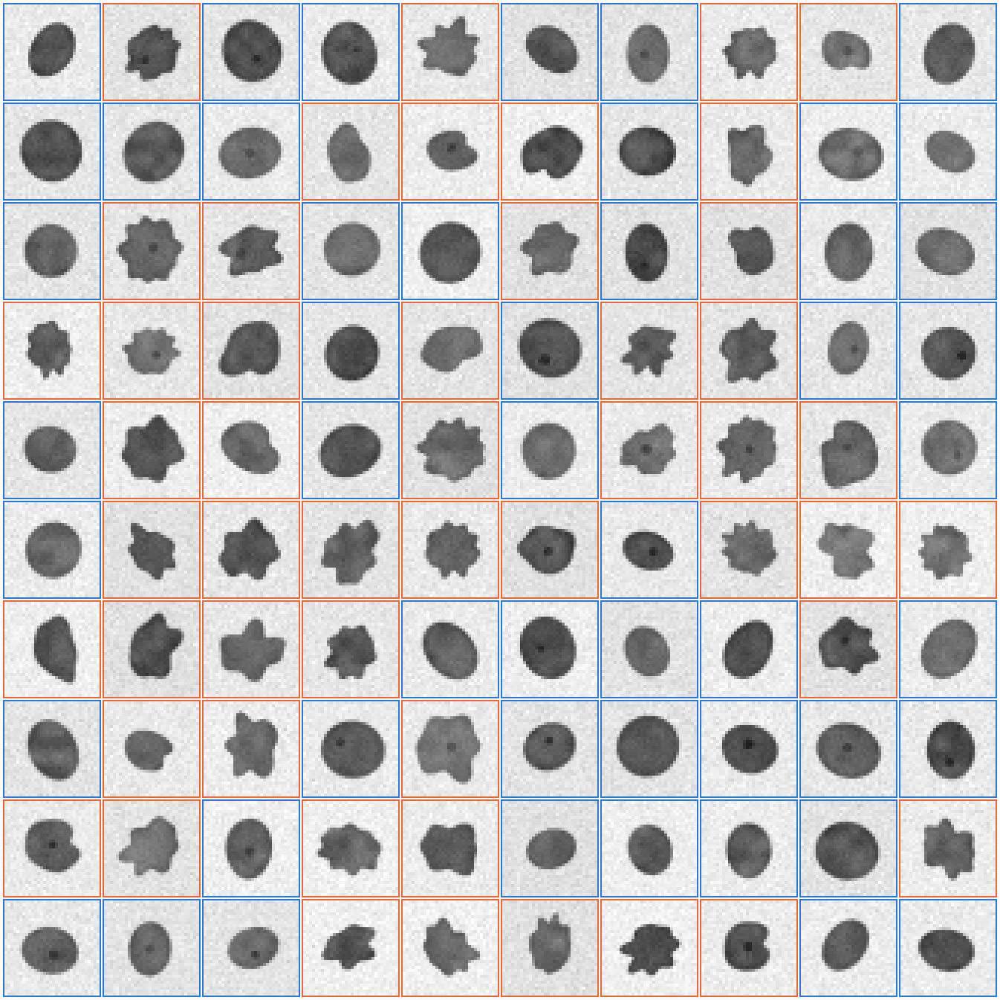

# Nucleus Net

An interactive, single-page teaching tool for an *AI for pathologists* lecture. Residents build a small neural network,
watch it train with every node and weight on screen, then run it on cases it has never seen. The page starts with a
clinical-pathology question (a blood count: leukaemia or not?) where the whole network fits on one screen, moves to
nuclei, and takes the network from a single layer on raw pixels to a convolutional network, with the reasons for each
step visible along the way. No installation, no server: open `index.html` in a browser.



## Running it

- **Locally:** double-click `index.html` (plain HTML/CSS/JS; it works from a `file://` URL).
- **One file to email or drop on a USB stick:** `dist/nucleus-net.html` has the stylesheet, scripts and all the cases
  inlined. Rebuild it with `node tools/build_single_file.js`.
- **GitHub Pages:** repository settings → Pages → *Deploy from a branch* → the default branch, root folder.

Keys during a lecture: `1` `2` `3` switch stages, `space` trains/pauses, `N` classifies the next test case.

The masthead has two dropdowns: the **question** (which dataset) and the **lecture recipe** (a one-click preset for
each step of the arc, which also switches the question if needed). The Train stage shows only the essential controls
(input, convolution, hidden units, Train / Step / Reset); everything else lives under *Advanced settings*. Controls that
do not apply to the current question are hidden.

## Three questions, one page

The **question** dropdown switches between three datasets, each with its own synthetic cases (80/20 split):

| Question | Cases | Positive class | What separates the classes | Decoys |
|---|---|---|---|---|
| **Leukaemia?** | 200 blood counts (160 / 40) | Leukaemia (acute, CML, CLL) vs No leukaemia (normal, bacterial infection, viral lymphocytosis, iron deficiency) | the pattern across ten CBC parameters | a raised white count on its own, cytopenias on their own |
| **Enlarged and hyperchromatic?** | 100 nuclei (80 / 20) | Enlarged (large, dark) vs Bland (small, pale) | size and darkness | contour shape (half of each class is irregular), elongation, rotation, texture, nucleolus, position |
| **Irregular contour?** | 100 nuclei (80 / 20) | Irregular (lobulated, notched, jagged) vs Regular (smooth ellipse) | the contour only | size, elongation, rotation, darkness, texture, nucleolus, position |

Every case also carries a hidden **subtype** (the kind of blood count, or the contour style of the nucleus). The
network never sees it; the page uses it to show which hidden units respond to which kind of case.

## The three stages

1. **Specimens.** All cases with their ground truth (test labels hidden until a lecturer's checkbox reveals them).
   Blood counts appear as fingerprint cards (one bar per parameter, up = above the reference range); nuclei as images.
   Click a case to inspect it: for a blood count a mock report with reference ranges and H/L flags, for a nucleus the
   image, its six morphometric measurements and an overlay showing exactly where each comes from. A scatter plot shows
   how separable any two parameters are.
2. **Train.** Choose the input (the measurements or blood count, or all 1,024 raw pixels), tick which inputs the network
   may use (withhold blasts and watch it lean on cytopenias), an optional convolutional layer (4 or 8 filters of 5 × 5,
   ReLU, 4 × 4 max-pooling), zero to two dense hidden layers with a ReLU / sigmoid / tanh activation, and the learning
   rate, batch size, epochs, seed, weight decay and flip/rotation augmentation. Press *Train*, or step one batch or one
   epoch at a time. The diagram redraws every frame: connection thickness and colour show each weight, node fill shows
   the value flowing through for the selected case, first-layer weights on pixels are drawn as 32 × 32 maps, and with a
   convolution you see the learned filters, their feature maps lighting up on the nucleus, and the pooled maps.
   Connections are drawn against a fixed scale so they visibly grow as the network learns, and a bright core marks the
   ones the last training step moved most. A single-layer network on pixels also shows the **weight × pixel** product
   map whose sum is the score. Hovering a feature-map pixel of a convolutional network shows the arithmetic of that
   position under the image: the 5 × 5 patch, the filter, their products, the sum and the ReLU. A
   single-layer network is also shown as a **weighted checklist** (every weight, largest first). With hidden units, a
   heatmap shows **what each unit responds to**: its mean activation for each hidden subtype, its weight to the output
   and the inputs it weighs most, and the training tray can be coloured by the most active unit instead of by the call.
   Learning curves plot loss and accuracy per epoch, with the test set "peeking" to show over-fitting.
3. **Test.** The weights are frozen. The held-out cases are classified one at a time (values animate through the
   network, then the truth is revealed) or all at once. For a convolutional network, *Classify next* walks through the
   convolution in about 30 seconds: filter 1 alone scans the nucleus slowly with the arithmetic of each position shown,
   the remaining filters sweep together at a quicker pace, then the 4 × 4 pooling blocks collapse into the pooled maps,
   then the dense units and the output fire. Press N or click the diagram to skip ahead. Accuracy, sensitivity, specificity and a confusion matrix
   accumulate; a decision-threshold slider shows the sensitivity/specificity trade-off, and a **prevalence** slider turns
   them into positive and negative predictive values for a realistic population.

The **inspector** on the right follows the selected nucleus through all three stages. Its *Evidence* view shows what the
network is weighing: on pixels, a per-pixel overlay (orange pushes toward the positive class, blue away from it), computed
by back-propagating the score to the input, so it works through hidden layers and the convolution too; on measurements, a
*push* bar per measurement.

## The lecture arc: the eight recipe buttons

Numbers are test-set accuracy, mean of three seeds, reproducible with `node tools/check_training.js`.

| Recipe | Parameters | Test accuracy | What it shows |
|---|---|---|---|
| ① Leukaemia · blood count · single layer | 11 | ~90% | The whole network on one screen. A perceptron is a weighted checklist: negative on neutrophil fraction, platelets and haemoglobin, positive on basophils, immature granulocytes, WBC and blasts. |
| ② Leukaemia · blood count · 3 ReLU units | 37 | ~95% | Hidden units organise themselves: one becomes an acute-leukaemia detector, one a CML detector, one a "looks healthy" detector with a negative weight; CLL is folded into a neighbour. Nobody told the network these types exist. |
| ③ Enlargement · pixels · single layer | 1,025 | 100% | A basic network works on pixels when the answer is a whole-image template: the weight map becomes a nucleus-shaped stencil. |
| ④ Irregularity · pixels · single layer | 1,025 | ~60% | Same network, new question: training accuracy hits 100% while the test curve stays at chance. Memorisation. No single template can capture "a bump somewhere on the outline". |
| ⑤ Irregularity · measurements · single layer | 7 | ~95% | Hand-made features rescue it: the weights land on solidity and contour roughness, the decoys stay near zero. |
| ⑥ Irregularity · pixels · 8 ReLU + augmentation | 8,209 | ~90% | Hidden units as learned feature detectors; flips and rotations turn 80 images into 640 views (roughly worth 8× more real data). |
| ⑦ Irregularity · pixels · 8 + 8 ReLU + augmentation | 8,281 | ~88% | A second layer is "deep learning" but buys only a few points here: depth is not the missing ingredient. |
| ⑧ Irregularity · pixels · convolution + 8 ReLU + augmentation | 3,361 | ~93% | The same 5 × 5 filter slides over the whole image, so a bend in the membrane is detected wherever it is. Fewer parameters, far better generalisation. |

## The data

`tools/generate_cbc.js` (no dependencies) draws the 200 blood counts from a fixed seed into `data/leukaemia/`
(`patients_data.js` for the page, `patients.json` and `patients.csv` for you). Each patient comes from one of seven
subtypes with plausible teaching distributions, not population data: acute leukaemia (40% of them aleukaemic, with a low
count and few blasts), CML (very high count, basophilia, marked left shift), CLL (lymphocytosis), normal, bacterial
infection (neutrophilia, left shift, a quarter septic with low platelets), viral lymphocytosis and iron-deficiency
anaemia (microcytosis, reactive thrombocytosis). Counts are log-transformed before standardization.

`tools/generate_nuclei.js` (no dependencies) draws both nucleus datasets from fixed seeds and writes, per task, into
`data/enlargement/` and `data/irregularity/`:

- `images/train/*.png`, `images/test/*.png` — 32 × 32 8-bit grayscale PNGs (80 + 20, class in the file name)
- `nuclei_data.js` — the same pixels, base64-encoded, loaded by the page
- `nuclei.json` — labels, split and the generator parameters of every nucleus
- `contact_sheet.png` — all 100 at 4×, for slides

Each nucleus is a dark ellipse on a pale, noisy background whose radius is modulated by low-order harmonics (lobulation),
localised clefts or blebs, or higher harmonics (jagged outlines). Chromatin texture, an optional nucleolus, a slightly
darker membrane and position jitter are added to every nucleus.

The six measurements are computed from the pixels in the browser (`js/features.js`): Otsu threshold → largest component
→ sub-pixel contour by marching squares. *Area*, *elongation* (second moments), *darkness* and *texture* (mean and spread
of ink two pixels in from the membrane), *solidity* (area ÷ convex-hull area) and *contour roughness* (perimeter ÷
perimeter of the smooth ellipse with the same area and elongation). Standardization uses training-set statistics only.

## Code map

```
index.html                 the page
css/style.css              tokens (light + dark) and components
js/features.js             measurements from pixels (browser + Node)
js/nn.js                   the network: optional convolution, 0–2 dense layers, hand-written backprop, weight decay (browser + Node)
js/dataset.js              decoding, blood-count fingerprints, flip/rotation augmentation, standardized inputs, withheld inputs (browser + Node)
js/viz.js                  canvas + SVG drawing: images, fingerprints, weight maps, filters, feature maps, evidence overlays, network diagram, charts
js/app.js                  state, task switch, training loop, the three stages, the inspector, unit heatmap, prevalence
tools/generate_cbc.js      make the blood-count dataset
tools/generate_nuclei.js   make both nucleus datasets
tools/check_training.js    gradient check + the eight recipes in Node
tools/build_single_file.js bundle everything into dist/nucleus-net.html
```
