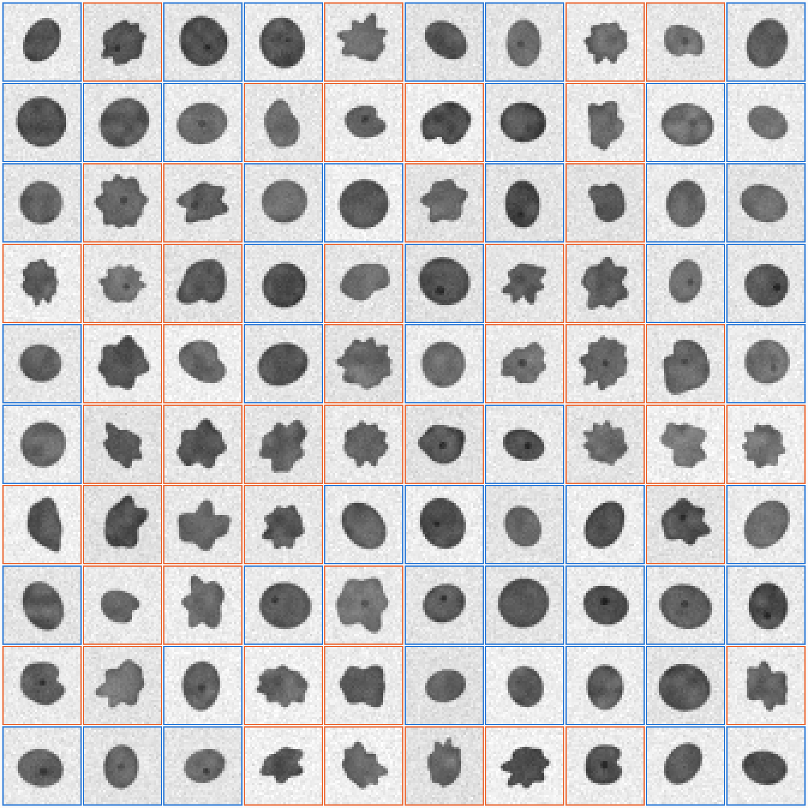

# Nucleus Net

An interactive, single-page teaching tool for an *AI for pathologists* lecture. Residents build a small neural network,
watch it train with every node and weight on screen, then run it on cases it has never seen. The page starts with a
clinical-pathology question (a blood count: leukemia or not?) where the whole network fits on one screen, moves to
nuclei (first as six hand-made measurements, then as raw pixels), and takes the network from a single layer on raw
pixels to a convolutional network, with the reasons for each step visible along the way, and ends by pretraining a
miniature foundation model on 100 unlabelled nuclei, live. No installation, no server: open `index.html` in a browser.



## Running it

- **Locally:** double-click `index.html` (plain HTML/CSS/JS; it works from a `file://` URL).
- **One file to email or drop on a USB stick:** `dist/nucleus-net.html` has the stylesheet, scripts and all the cases
  inlined. Rebuild it with `node tools/build_single_file.js`.
- **GitHub Pages:** repository settings → Pages → *Deploy from a branch* → the default branch, root folder.
- **The numbers in this file:** `node tools/check_training.js` (the recipes, the other lab, the shortcut, label noise,
  the labelled-cases table), `node tools/check_foundation.js` (the foundation model's pretraining),
  `node tools/pretrain_backbone.js --measure` (the shipped encoder's ablation) and `node tools/check_slides.js`
  (attention over slides) reproduce them.

Keys during a lecture: `1` `2` `3` switch steps, `space` trains/pauses, `T` or `N` teaches the next case one step
(Train) and `N` classifies the next test case (Test).

The masthead has two dropdowns: the **question** (which dataset) and the **lecture recipe** (a one-click preset for
each step of the arc, which also switches the question if needed). The Train stage shows only the essential controls
(input, convolution, hidden units, and the training buttons in the order a resident should try them: Teach next case,
Step batch, Step epoch, Complete training, Reset); everything else lives under *Advanced settings*. Controls that
do not apply to the current question are hidden.

## Four questions, one page

The **question** dropdown switches between four datasets, each with its own synthetic cases (80/20 split):

| Question | Cases | Positive class | What separates the classes | Decoys |
|---|---|---|---|---|
| **Leukemia?** | 200 blood counts (160 / 40) | Leukemia (acute, CML, CLL) vs No leukemia (normal, bacterial infection, viral lymphocytosis, iron deficiency) | the pattern across ten CBC parameters | a raised white count on its own, cytopenias on their own |
| **Atypical nucleus?** | 100 nuclei (80 / 20) | Atypical (enlarged, hyperchromatic, irregular contour or coarse chromatin, alone or combined; six nuclei carry each trait on its own) vs Bland | size, darkness, contour and texture, in any combination | elongation, rotation, nucleolus, position |
| **Enlarged and hyperchromatic?** | 100 nuclei (80 / 20) | Enlarged (large, dark) vs Bland (small, pale) | size and darkness | contour shape (half of each class is irregular), elongation, rotation, texture, nucleolus, position |
| **Irregular contour?** | 100 nuclei (80 / 20) | Irregular (lobulated, notched, jagged) vs Regular (smooth ellipse) | the contour only | size, elongation, rotation, darkness, texture, nucleolus, position |

Every case also carries a hidden **subtype** (the kind of blood count, the traits of an atypical nucleus, or the contour
style). The network never sees it; the page uses it to show which hidden units respond to which kind of case.

## Three steps for every question

The masthead lists eight questions: a blood count, three nucleus questions, the foundation model, two questions asked
of slides, and the fields of bladder. Whatever the question, the nav has the same three steps, and a lecture recipe simply selects a question and
its settings.

1. **Specimens.** All cases with their ground truth (test labels hidden until a lecturer's checkbox reveals them).
   Blood counts appear as fingerprint cards (one bar per parameter, up = above the reference range); nuclei as images.
   Click a case to inspect it: for a blood count a mock report with reference ranges and H/L flags, for a nucleus the
   image, its six morphometric measurements and an overlay showing exactly where each comes from. A scatter plot shows
   how separable any two parameters are. For the nucleus questions, a *Where the cases come from* card says which lab's
   scans each set uses (see *Another lab, and the shortcut* below).
2. **Train.** Choose the input (the measurements or blood count, all 1,024 raw pixels, or the **code** from a foundation
   encoder: the one pretrained in the foundation question or the one shipped with the page), tick which inputs the network
   may use (withhold blasts and watch it lean on cytopenias), an optional convolutional layer (4 or 8 filters of 5 × 5,
   ReLU, 4 × 4 max-pooling), zero to two dense hidden layers with a ReLU / sigmoid / tanh activation, and the learning
   rate, batch size, epochs, seed, weight decay and flip/rotation augmentation. Teach one case, step one batch or one
   epoch, or press *Complete training*. The diagram redraws every frame: connection thickness and colour show each weight, node fill shows
   the value flowing through for the selected case, first-layer weights on pixels are drawn as 32 × 32 maps, and with a
   convolution you see the learned filters, their feature maps lighting up on the nucleus, the pooled maps, and each
   hidden unit's weights over the pooled cells drawn as one stacked map, with its product map once a case has run.
   Connections are drawn against a fixed scale so they visibly grow as the network learns, and a bright core marks the
   ones the last training step moved most. A single-layer network on pixels also shows the **weight × pixel** product
   map whose sum is the score, and every pixel-fed hidden unit shows its own weight × pixel map beside its weight map.
   Each row reads **image × weights = weight × pixel** (the image arrives along the band, pixel by pixel), with the
   activation badge after it (sum plus bias, through the activation). Hovering a feature-map pixel of a convolutional network shows the arithmetic of that
   position under the image: the 5 × 5 patch, the filter, their products, the sum and the ReLU. A
   single-layer network is also shown as a **weighted checklist** (every weight, largest first). **Teach next case** shows
   back-propagation on one training case as a six-step walk-through (five without a hidden layer), each step named in a
   strip above the diagram: (1) the forward pass, each dense connection wiping from source to target with thickness =
   weight × the value at its start and the colour of its sign, so each node's sum can be read off, hop by hop to the output
   (on pixels the mean training nucleus is first subtracted from this one, so the network sees the difference, which is
   large at the membrane and near zero in the centre, and the three tiles stay up for the rest of the walk-through; that
   difference is laid over each weight map, the product map forms cell by cell and is set aside, a scan line
   sums it with orange cells against blue, and the bias and the ReLU, or the sigmoid at the output, finish the unit;
   the first unit runs slowly, the rest together); (2) the loss, the call against
   the truth on a scale beside the output, with the loss curve above it and the error (p − y) as its slope; (3) the
   backward pass, the error wiping back along each connection as error × weight (thick = large, blue: the unit should
   come down, orange: go up), one layer at a time, and a pill on each unit spelling out what arrived and what ReLU let
   through (a unit that was switched off gets none); (4) the gradients, blame at one end of a connection × activity at
   the other, drawn as a glow on each connection with the arithmetic written on the connections of small layers and, on
   pixels, as a copy of the nucleus scaled by the unit's blame that comes back from the blame side onto each weight map;
   (5) the update, the connections and maps visibly moving to w − learning rate × gradient, each labelled connection
   showing its weight before → after; (6) the check, the same case running forward again with the new weights, a replay
   to show what the step did rather than a part of training, which moves straight on to the next case. The step is real
   training, a batch of one at the current learning rate. Each press teaches the next case in the training set (or the case you
   picked in the tray; with label noise on, the lesson teaches the label the case was given and says so when it is wrong). For a convolutional network the forward pass and the check are the convolution walk-through
   (preprocessing, the filters scanning, the pooling, the pooled maps × each unit's weight map, the dense hops), and the
   backward steps go on past the dense layer: in the backward pass the blame of each pooled cell (Σ unit blame × its
   weight) wipes back along the bands and is drawn over the pooled maps, then goes back through the pooling onto the one
   position per block that won the max (dots on the feature maps; ReLU passes it only where the map was on, a hollow dot
   got none); in the gradient step each unit's weight map receives a copy of the stacked pooled maps scaled by its blame,
   and then the filters, whose gradient adds up over every position that got blame (the blame there × the 5 × 5 image
   patch under the filter): filter 1 accumulates position by position, with the window on the image and the arithmetic
   under it (patch → × blame → Σ so far), the other filters all at once, and the step settles over each filter as a Δ
   until the update folds it in; in the update the filters visibly move too. Every walk-through (the lesson and
   *Classify next*) plays at its normal pace unless you touch the controls in its strip: pause/play, previous and next
   step, and a speed slider (space pauses, ← → step, N skips ahead); while paused, the step buttons show each step at
   its end. With hidden units, a
   heatmap shows **what each unit responds to**: its mean activation for each hidden subtype, its weight to the output
   and the inputs it weighs most, and the training tray can be coloured by the most active unit instead of by the call.
   Learning curves plot loss and accuracy per epoch, with the test set "peeking" to show over-fitting; when peeking, a
   dotted line marks the epoch of the lowest test loss so far (where early stopping on a held-out set would have
   stopped), and with label noise on, a dashed line marks the honest ceiling of training accuracy. *Label noise* in the
   advanced settings flips a share of the training labels, as a second pathologist might have called them; the trays and
   the inspector then show the label each case was given, and a checkbox marks the mislabelled ones. A *Labelled
   cases* control (4, 10, 20, 40 or all) withholds the labels of the rest of the training set: those cases stay in the
   tray, dimmed and dashed, the network never sees them and the training scores skip them, which is how the value of a
   pretrained code is shown (see *The code as an input*). With the code as input the inspector adds a card with the
   code's numbers and each one's push on the score, and its *Evidence* view carries that push back through the frozen
   encoder to the pixels.
3. **Test.** The weights are frozen. *Classify next* runs one held-out case as a walk-through: a forward pass through
   the frozen weights, each connection wiping with the product it carries while a strip names what is happening, then the call at the threshold,
   then the truth with a ✓ or ✗ on the diagram; *Classify all* scores the rest at once. A *Test cases from* switch swaps the
   held-out nuclei for the other lab's scans of the same nuclei (or a mix of both labs), and a table keeps the scores of
   every test set run since the weights last changed. For a convolutional network, *Classify next* walks through the
   convolution in about 45 seconds: the mean training nucleus is subtracted first (the three tiles stay up), filter 1
   alone scans the difference image slowly with the arithmetic of each position shown, the remaining filters sweep
   together at a quicker pace, then feature map 1 is pooled block by block (each 4 × 4 block shown with its largest value
   and the single pooled cell it becomes), the other maps follow together, then the dense layer runs exactly like the
   pixel hop: the pooled maps gather into one stacked map over hidden unit 1's weight map (its weights over the pooled
   cells, stacked the same way and drawn beside the pooled column at all times), the product map wipes in and slides
   aside, a scan line sums it while the unit counts, the bias and the ReLU finish it, and the other units follow
   together; the units' values then wipe to the output and the call is made. Press N or click the diagram to skip ahead.
   In any convolutional diagram, hovering a pooled cell outlines its source block, hovering a feature-map pixel marks the
   pooled cell it feeds, and hovering a cell of a stacked weight or product map names the pooled map and cell it belongs to. Accuracy, sensitivity, specificity and a confusion matrix
   accumulate; a decision-threshold slider shows the sensitivity/specificity trade-off, and a **prevalence** slider turns
   them into positive and negative predictive values for a realistic population.
For the **foundation question** the three steps are the same three, with pretraining in the middle. *Specimens* is the
100 nuclei from all three image questions (34 / 33 / 33 of their training sets) without a single label; the tray can be
coloured by question or by the answer to each nucleus's own question, which the model never sees. *Train* is the
pretraining: a convolutional encoder (4 filters of 5 × 5, pool 4 × 4, a linear layer to a **code** of 8 numbers) trained
by instance discrimination. Every batch takes 20 nuclei and two random *views* of each (a flip or rotation, and the
other lab's scan of it when the checkbox allows); the loss pulls the two views of a nucleus together and pushes every
other view of the batch away. The page shows the rule as the game it is, *spot the same nucleus*: a line-up puts one
view against every other view of the batch as a candidate, best first, with the encoder's vote for each (a softmax over
the cosines of the codes) and the answer framed in orange; the encoder diagram shows the same pair live (the codes of
both views as strips, their cosine, the three nearest other nuclei of the batch and the pair's share of the vote, which
is the loss); a strip shows what the code keeps and ignores (one nucleus in all 8 orientations from both labs with the
code of each view, at the start and now, then another nucleus); a similarity matrix shows the batch, every view against
every other, with the pairs ringed; an embedding map plots any two code numbers for every nucleus and its second view;
and the contrastive loss runs per epoch on the batches and on 60 held-out nuclei. *Test* is *what the code is worth*:
after every epoch a single layer is trained on the frozen code with 20 labelled cases per question and scored on 40
nuclei it never saw, as a curve per question and a table before and after pretraining. See *A foundation model, in
miniature*. The encoder then serves as the *code* input of the nucleus questions (see *The code as an input*); that
input and the *Labelled cases* control stay hidden until the foundation question, a slides question or recipe ⑪ or ⑫
has been visited, so the earlier steps are uncluttered until then.

For the **slides questions** *Specimens* is the training and test slides with their labels: click a slide to see its
20 nuclei, and *Reveal* marks the atypical ones, which the model never sees. *Train* is weak supervision: one label per
slide, and attention learns which nuclei matter. The slide is shown with a frame on every nucleus scaled by its
attention weight, the twenty nuclei ranked by weight beside it, the whole model unrolled on one diagram (every nucleus
through the one scorer, the softmax, the weighted sum and the single layer, with a step-by-step walk-through), the small
attention network for the nucleus under the cursor, the weighted summary and the call, and three curves per epoch:
loss, slide accuracy and the share of a positive slide's attention landing on its atypical nuclei. A *plain average*
switch shows what the attention buys. The second slides question, *a focus of atypical cells?*, has the same nuclei in
both classes and only their arrangement differs; a *context* switch adds one layer of self-attention, and a *Who looks
at whom* card draws it. *Test* walks through the held-out slides one at a time, like Test for any other question: the
call, the truth, the attention on that slide and a running tally. See *Slides: one label for twenty nuclei*.

The **inspector** on the right follows the selected nucleus through the three steps of a blood count or nucleus question. Its *Evidence* view shows what the
network is weighing: on pixels, a per-pixel overlay (orange pushes toward the positive class, blue away from it), computed
by back-propagating the score to the input, so it works through hidden layers and the convolution too; on measurements, a
*push* bar per measurement. For a nucleus it also shows the same nucleus as scanned at both labs, with the network's
call for each scan.

## The lecture arc: the fifteen recipe buttons

Numbers are test-set accuracy, mean of three seeds, reproducible with `node tools/check_training.js` (recipe ⑬:
`node tools/check_slides.js --epochs 60 --lr 0.02`; recipe ⑭: `node tools/check_slides.js --question focus --context none,distX
--decay 0.001 --nopos --epochs 150 --lr 0.02`).

| Recipe | Parameters | Test accuracy | What it shows |
|---|---|---|---|
| ① Leukemia · blood count · single layer | 11 | ~90% | The whole network on one screen. A perceptron is a weighted checklist: negative on neutrophil fraction, platelets and hemoglobin, positive on basophils, immature granulocytes, WBC and blasts. |
| ② Leukemia · blood count · 3 ReLU units | 37 | ~95% | Hidden units organise themselves: one becomes an acute-leukemia detector, one a CML detector, one a "looks healthy" detector with a negative weight; CLL is folded into a neighbour. Nobody told the network these types exist. |
| ③ Atypia · measurements · single layer | 7 | ~95% | One approach to images: measure what a pathologist would name (area, darkness, chromatin texture, solidity, contour roughness) and let a single layer weigh the numbers. The checklist reads like a grading scheme: every trait measurement earns a weight, because each trait appears on its own in some nuclei, and elongation, the decoy, stays near zero. |
| ④ Atypia · measurements · 8 + 8 ReLU · a quarter of the training labels wrong | 137 | ~97% early, ~83% after 300 epochs | Overfitting in its textbook shape. With 20 of the 80 training labels flipped, the network first learns the rule (the test curve peaks early), then memorises the mislabelled cases: training accuracy climbs past the honest ceiling of 75% while the test curve falls. See *Label noise and overfitting*. |
| ⑤ Enlargement · pixels · single layer | 1,025 | 100% | The other approach: raw pixels. A basic network works on pixels when the answer is a whole-image template: the weight map becomes a nucleus-shaped stencil. |
| ⑥ Irregularity · pixels · single layer | 1,025 | ~60% | Same network, new question: training accuracy hits 100% while the test curve stays at chance. Memorisation. No single template can capture "a bump somewhere on the outline". Switching the input to measurements rescues it (~95%, the weights land on solidity and contour roughness), but someone had to invent those measurements. |
| ⑦ Irregularity · pixels · 4 ReLU + augmentation | 4,105 | ~77% | Hidden units as learned feature detectors; flips and rotations turn 80 images into 640 views (roughly worth 8× more real data). |
| ⑧ Irregularity · pixels · 4 + 4 ReLU + augmentation · then try the other lab | 4,125 | ~82% | A second layer is "deep learning" but buys only a few points here: depth is not the missing ingredient. The recipe to show the other lab on: switch the test cases to the other lab and it falls to chance, and stain normalisation repairs it (see *Another lab, and the shortcut*). |
| ⑨ Irregularity · pixels · 4 + 4 ReLU · the shortcut | 4,125 | 97% on a test set with the same flaw, ~55% at our lab | The network of ⑧ trained on a badly collected set: every irregular nucleus was scanned at another lab with a weaker stain. It learns the stain instead of the contour: the first-layer weight maps turn into plain interior templates, the *Evidence* view weighs the inside of the nucleus, the test set looks perfect when it is split the same way, and our lab's scans are called regular. See *Another lab, and the shortcut*. |
| ⑩ Irregularity · pixels · convolution + 4 ReLU + augmentation | 897 | ~88% | The same 5 × 5 filter slides over the whole image, so a bend in the membrane is detected wherever it is. Fewer parameters, far better generalisation. |
| ⑪ Foundation · pretrain a code on 100 unlabelled nuclei | 1,680 | a single layer on the code, 20 labelled cases per question: ~81% atypia, ~97% enlargement, ~83% irregularity | The foundation-model idea in miniature: pretrain once without labels, then every question is a small model on top of the code. The right-hand curve shows the code becoming worth more for every question as pretraining runs, though it was never told what any question asks. See *A foundation model, in miniature*. |
| ⑫ Irregularity · the foundation code · single layer · 10 labelled cases | 9 | ~82% with 10 labelled cases, mean of three seeds (the page's seed 8: 75%; pixels with the same 10: ~60%) | The payoff of the pretraining: the network sees 10 labelled nuclei only, each as the 8 numbers of the code from the encoder of ⑪ (or its shipped copy), and a single layer on them beats any pixel network trained on all 80. Move the *Labelled cases* control on recipe ⑥ to compare, and switch to the bigger shipped encoder at 40 cases. See *The code as an input*. |
| ⑬ Slides · one label for 20 nuclei · attention finds the atypical ones | 50 | ~98% slide accuracy on the test slides; ~85% of a positive slide's attention on its 2–4 atypical nuclei (uniform weights: 15%; a plain average: 90% and no idea where) | Weak supervision. A diagnosis is a label for the slide, yet the atypical cells are a few among many and nobody outlines them. An attention network scores every nucleus's code, a softmax over the slide turns the scores into weights, and the weighted average of the codes is classified. Only the slide's label teaches it, and the attention still learns to land on the atypical nuclei: tick *Reveal* after training and look. See *Slides: one label for twenty nuclei*. |
| ⑭ Focus · four atypical cells together or scattered · the nuclei look at each other | 483 | ~88% on the test slides with context; ~50% without, by construction | The warm-up for a transformer. Four atypical nuclei on every slide, a 2 × 2 block or scattered, so the bag of nuclei is identical in both classes and the model of ⑬ is at chance. One layer of self-attention lets each nucleus read the others, with a learned cost per cell of distance; it learns to listen to its immediate neighbours, and the scorer can then weigh "atypical, with atypical neighbours". Hover a nucleus to see whom it listens to, and the *How a nucleus decides where to look* card for the query, the keys, the match, the distance cost, the softmax and the message. See *A focus, and the nuclei look at each other*. |
| ⑮ Fields · is it invasive? · cytology, location and arrangement · two heads, one per question | 1,186 | ~100% CIS right and ~90% invasion right on the test fields; three invasive fields in four found, one CIS-into-nests field in four still called invasive | The transformer at work on a diagnosis with three cues. A strip of bladder holds thirty to fifty nuclei, one of five patterns, and two labels: carcinoma in situ, invasion. Every nucleus is its code (masked to the nucleus, so the code is cytology and nothing else) plus its position; two layers of self-attention let the nuclei read each other with a learned distance cost; two attention heads over the same nuclei answer the two questions. Watch the mimic table: cytology alone gets the bland patterns, positions add the membrane, and the context is what tells a round von Brunn nest with CIS in it from an angulated invasive nest. Switch a cue off (*its code* alone, context *none*) and train again to see which mimic fools the model. See *Invasion: the field model*. |

The pixel recipes use four hidden units and four filters so that every weight map, filter and feature map stays legible on
a laptop screen. The sliders go to eight; over eight seeds, eight units score about 81% on ⑦ (four: 79%), 87% on ⑧
(four: 81%) and 94% on ⑩ (four: 93%).

## Another lab, and the shortcut

Every nucleus comes as two scans: ours, and the same nucleus as scanned at **another lab whose stain is weaker** (a paler
nucleus, less chromatin and membrane contrast, a touch paler background; the same shape, the same chromatin pattern, the
same optics). The *Where the cases come from* card in the Specimens stage says which scans each set uses: our lab, the
other lab, both labs mixed at random (half of each class from each lab), or both labs split by class (the positives from
the other lab, the negatives from ours). The Test stage repeats the test-set choice next to the threshold and keeps a
table of the scores of every test set run since the weights last changed; the inspector shows the selected nucleus as
scanned at both labs with the network's call for each; a checkbox marks the cases scanned at the other lab with a **B**.
Two teaching points come out of this:

- **Lab differences.** Train any image recipe at our lab, then switch the test cases to the other lab and classify
  again. The dense pixel networks collapse to chance: they learned templates of absolute ink, and a paler nucleus turns
  the difference image blue across its whole interior (the inspector's pair of scans shows the call flipping on the same
  nucleus). The measurements recipe loses twenty points because darkness and texture are read off the raw scan. The
  convolution barely drops, because its filters read edges. The remedy is **stain normalisation** (Advanced settings):
  *per lab*, each lab's typical background and nucleus levels, measured from its scans without any label, are matched to
  ours, the toy version of matching a slide's colour statistics to a reference slide; *per image*, each scan is rescaled
  by its own levels, which also throws away hyperchromasia as a feature. Normalised, every pixel recipe scores as well at
  the other lab as at home. The walk-throughs then show the normalised scan in the preprocessing row.
- **Shortcut learning (recipe ⑨).** The 4 + 4 network of ⑧, trained on a set where every irregular nucleus was scanned
  at the other lab and every regular one at ours. Training accuracy hits 100% and so does the test set when it carries
  the same split, because the stain is a perfect shortcut to the label and easier to learn than the contour: the
  first-layer weight maps turn into plain interior templates instead of contour detectors, and the *Evidence* overlay
  shows the network weighing the interior of the nucleus rather than its outline (the convolution of ⑩ falls for it just
  the same; its numbers are in the second table below). Switch the test cases
  to our lab and the sensitivity collapses (the irregular nuclei are well stained, so they are called regular); switch
  them to the other lab and the specificity collapses. This is the pen-mark and hospital-watermark story of the medical
  AI literature. Two things defuse it: stain normalisation per lab, and collecting both classes from both labs (training
  cases from *both labs, mixed at random*).

Test accuracy, mean of three seeds (`node tools/check_training.js`):

| Recipe, trained at our lab | at our lab | at the other lab | normalised per lab: our lab / the other lab |
|---|---|---|---|
| ③ Atypia · measurements · single layer | 95% | 75% | the measurements are read off the raw scan |
| ⑤ Enlargement · pixels · single layer | 100% | 92% | 100% / 100% |
| ⑥ Irregularity · pixels · single layer | 60% | 55% | 60% / 57% |
| ⑦ Irregularity · pixels · 4 ReLU + augmentation | 77% | 50% | 77% / 80% |
| ⑧ Irregularity · pixels · 4 + 4 ReLU + augmentation | 82% | 52% | 82% / 82% |
| ⑩ Irregularity · pixels · convolution + 4 ReLU + augmentation | 88% | 85% | 88% / 92% |

| ⑨ The 4 + 4 network of ⑧, trained on… | test split by class | test at our lab | test at the other lab | test mixed |
|---|---|---|---|---|
| irregular from the other lab, regular from ours | 97% | 55% | 52% | 52% |
| the same, stain normalised per lab | 78% | 77% | 82% | 82% |
| both labs, mixed at random | 68% | 75% | 58% | 73% |

| The convolution of ⑩, trained the same way (no longer a recipe) | test split by class | test at our lab | test at the other lab | test mixed |
|---|---|---|---|---|
| irregular from the other lab, regular from ours | 100% | 58% | 57% | 57% |
| the same, stain normalised per lab | 93% | 90% | 92% | 88% |
| both labs, mixed at random | 90% | 92% | 90% | 92% |

## Label noise and overfitting

None of the clean recipes overfits in the textbook way: the pixel networks that memorise never generalised in the first
place, so their test curve never had a peak to fall from, and the measurement and blood-count networks are too small,
with too clean a signal, to overfit at all. The test *loss* does rise once a pixel network without weight decay trains
on, from 0.49 at its minimum around epoch 10 to 0.9 by epoch 300 on recipe ⑦, while the test accuracy stays flat: the
network makes no more errors, it only grows more confident in the errors it makes.

Label noise brings the classic curve out, and it is a pathology-native reason for it: labels are a consensus with
disagreement in them. Recipe ④ trains the atypia measurements with 8 + 8 units and a quarter of the training labels
flipped (a fixed set of 20, so the lecture is reproducible whatever the seed). The network first learns the rule from
the majority of right labels, so the test accuracy, scored against the true labels, peaks early; then it memorises the
mislabelled cases one by one, training accuracy climbs past the **honest ceiling** of 75%, and the test curve falls while
the test loss rises. Tick *Mark the mislabelled cases* and watch the ✗ badges on them disappear as they are memorised.
The dotted **lowest test loss** marker shows where early stopping would have stopped. Weight decay, fewer units, or
stopping early all soften it; the labels stay wrong.

Mean of three seeds (`node tools/check_training.js`): test accuracy peaks at 97% (epochs 2 to 14) and ends at
83% after 300 epochs; the test loss goes from 0.31 at its minimum to 0.48; training accuracy ends at 88%,
above the 75% ceiling.

## A foundation model, in miniature

Recipe ⑪ and the foundation question. The idea of a foundation model is that the expensive part, learning what images are
made of, is done once, on many unlabelled images, and every later question is a small model on top of the resulting
**code**. The miniature keeps every part visible: 100 nuclei from the three image questions' training sets (34 / 33 /
33, our lab's scans, never a label), an encoder of 1,680 weights (4 filters of 5 × 5, pool 4 × 4, a linear layer to a
code of 8), and a pretraining rule with no labels in it, instance discrimination, which the page presents as the game
it is, **spot the same nucleus**: take a nucleus and make two views of it (a flip or rotation, or the other lab's scan);
the encoder turns each view into 8 numbers; among all the other views in the batch it must find the partner by
comparing the numbers; the weights are nudged so the partner scores higher next time. Nothing rebuilds the image. A
batch takes 20 nuclei with two random views each; for each view the loss is minus the log of its partner's share of a
softmax over every other view of the batch at temperature 0.2 (so it starts near −log(1/39) ≈ 3.7), and the gradient
runs back through the normalisation, the code layer and the convolution exactly as in the classifiers (learning rate
0.05, no weight decay, 100 epochs by default).

The pretext task matters. An autoencoder (the same encoder plus a linear decoder, trained to reconstruct the image) was
tried first and rejected: its code captures size and darkness but leaves contour irregularity at chance however long it
trains, because a smooth blob reconstructs almost as well as a lobulated one. The contrastive rule has to keep each
nucleus recognisable across flips, rotations and stains, and the contour is part of what does that. The class is still
in `js/nn.js` (`AutoEncoder`) for comparison.

What the code is worth is measured on the side after every epoch and never fed back: a single layer is trained on the
frozen code with 20 labelled training cases of a question (10 per class) and scored on 40 nuclei it never saw (the
question's 20 test nuclei and its 20 held-out training nuclei). Mean of three seeds (`node tools/check_foundation.js`):

| Epoch | Held-out loss | Partner found | Atypia | Enlargement | Irregularity |
|---|---|---|---|---|---|
| 0 (random encoder) | 3.44 | 15% | 74% | 80% | 60% |
| 10 | 2.31 | 39% | 84% | 98% | 61% |
| 25 | 1.87 | 63% | 82% | 98% | 79% |
| 50 | 1.62 | 70% | 85% | 98% | 80% |
| 100 | 1.40 | 81% | 81% | 97% | 83% |

*Partner found* is the share of held-out views whose nearest other view, by cosine, is their own partner. Enlargement is
readable even from a random code (size is total ink, which any filter passes on), atypia is mostly size and darkness
too, and contour irregularity is what the pretraining earns: from chance to about 80% with 20 labelled cases, where
recipe ⑦ needed all 80 labelled cases and their 640 augmented views to reach 77%. Scored on the other lab's scans of the
same nuclei, the single layer keeps 83% / 89% / 79%: the code was made to see past the stain. Untick *The other lab's
scans count as views* and it no longer is. The measurements cost about as much as the pretraining itself (some 80 ms
per epoch for both in Node); at the default speed of 4 epochs per second the 100 epochs take about half a minute.

## The code as an input, and how many labelled cases it needs

Recipe ⑫ and the *Labelled cases* control close the loop on why anyone pretrains. In the Train step of a nucleus question the third input, **the
code**, feeds the network the encoder's 8 (or 16) numbers for each nucleus instead of its pixels or measurements; the
*Code from* control picks the encoder: the one pretrained in the foundation question, or one of two shipped with the page
(`data/foundation/backbones.js`, written by `tools/pretrain_backbone.js`): a saved copy of exactly what the foundation question
makes with seed 1 (100 nuclei, 4 filters, a code of 8, 100 epochs), so the recipe works before anyone has run ⑪, and a
bigger encoder (the page's 240 training nuclei, 8 filters, a code of 16, 200 epochs). Everything else works as for the
measurements: the diagram shows the code numbers as inputs, the checklist lists their weights, the inspector adds a
card with each number's value and push, and its *Evidence* view carries the push back through the frozen encoder to
the pixels. The *Labelled cases* control (4, 10, 20, 40 or all) keeps the first n/2 of each class in the training order
as labelled and withholds the labels of the rest: they stay in the tray, dimmed and dashed, the network never trains
on them and the training scores skip them, though their images still serve to standardise the inputs, as an
unlabelled archive would.

Irregular contour, test accuracy at our lab, mean of five seeds (`node tools/check_training.js --only labelled --seeds 5`),
a single layer for 60 epochs except the augmented column (4 ReLU units, the recipe ⑦ network):

| Labelled cases | Measurements | Pixels | Pixels · 4 ReLU + augmentation | The code · 100 nuclei, 4 filters | The code · 240 nuclei, 8 filters |
|---|---|---|---|---|---|
| 4 | 93% | 53% | 49% | 78% | 56% |
| 10 | 84% | 60% | 64% | 82% | 58% |
| 20 | 91% | 69% | 74% | 71% | 73% |
| 40 | 95% | 66% | 59% | 80% | 85% |
| 80 (all) | 95% | 60% | 80% | 80% | 90% |

Three things to read off it. Pixels stay at chance however many labels there are, and the best pixel network of the
lecture needs all 80 cases and their augmented views to reach 80%. The code of the stage-4 encoder gets there with 4
to 10 labelled cases: pretraining on 100 unlabelled nuclei bought what 70 labels could not. And the hand-made
measurements win at every count, because solidity and contour roughness were designed for exactly this question; the
code is a general-purpose set of numbers that nobody had to design, and most questions in pathology come without such
measurements. With 20 test nuclei and one fixed draw of labelled cases the numbers are noisy: another draw of 10
labelled cases moves the code's score by ten points either way (over random draws it averages 73 to 75%), which is
why the recipe keeps its draw fixed.

One more thing the small numbers make visible: **an untrained network on the code is not at chance.** Every code number
carries information on its own (their correlations with the irregularity label run up to 0.71), so any random
weighting of them is already a classifier, pointing the right way or the wrong way by the luck of the seed. Before a
single step of training, seed 1 scores 80% on the 10 labelled cases and 70% on the test set, seed 9 scores 20% and
25%, seed 11 70% and 90%; over many seeds it averages 50%, but no one seed sits there. A random weighting of 1,024
pixels averages out to about 50% every time. Recipe ⑫ therefore starts from seed 8, whose untrained network sits near
chance (50% train, 45% test) so that the curve visibly climbs, and every other recipe starts from seed 1; roll the
dice on ⑫ and watch where it starts.

**Does a bigger encoder help?** `node tools/pretrain_backbone.js --measure` pretrains five encoders and probes each
one the same way (a single layer on the frozen code, n labelled cases per question as random draws, scored on the 20
test nuclei); mean over the three questions and two pretraining seeds:

| Pretraining set · encoder | 4 | 10 | 20 | 40 | 80 | Other lab, 20 |
|---|---|---|---|---|---|---|
| The page's 100 nuclei · 4 filters, code of 8 · 100 epochs (the foundation question; shipped) | 69% | 80% | 86% | 88% | 88% | 84% |
| The page's 240 training nuclei · 4 filters, code of 8 · 200 epochs | 63% | 75% | 83% | 86% | 86% | 83% |
| The page's 240 training nuclei · 8 filters, code of 16 · 200 epochs (shipped) | 66% | 75% | 89% | 91% | 93% | 87% |
| 2,100 generated nuclei · 4 filters, code of 8 · 60 epochs | 62% | 74% | 87% | 87% | 86% | 86% |
| 2,100 generated nuclei · 8 filters, code of 16 · 60 epochs | 64% | 74% | 86% | 88% | 92% | 85% |

Not much, and not at all where it would matter most. With 4 to 20 labelled cases every encoder lands within a few
points of the stage's own 100-nucleus one, which is the best of them at 4 and 10. Only with 40 to 80 labelled cases do
the 8-filter encoders pull ahead (91 to 93% against 88%), and the one pretrained on the page's 240 nuclei is the best
of those, which is why it ships as the second option. Twenty-one times more generated nuclei bought nothing: a hundred
nuclei already span everything this generator can draw, and longer pretraining makes the code better at telling
individuals apart rather than at the traits the questions ask about. In this miniature the scaling story of the real
foundation models does not reproduce, and the page says so rather than pretending otherwise.

## Slides: one label for twenty nuclei

Recipe ⑬ and the slides questions. Everything before it labels the nucleus. A pathologist's label is a diagnosis for the
slide, and a slide holds thousands of cells of which the decisive ones may be a handful; nobody outlines them. That is
the setting of *multiple-instance learning*: a bag of instances, one label for the bag, and the instances that earned
the label unknown. The miniature keeps the word *slide*: 60 training slides and 20 test slides of 20 nuclei each, drawn
from a pool of 240 (160 bland, 80 atypical in the four ways of the atypia question), each nucleus in a random
orientation. A slide is *atypical cells present* when it holds 2 to 4 atypical nuclei (mean 3.0) and *no atypical cells*
when it holds none, so weights spread evenly would give the atypical nuclei of a positive slide 15% of its attention.
The test slides use nuclei that never appear in a training slide.

The model is attention-based pooling (Ilse, Tomczak and Welling, 2018), the shape of the slide-level models in digital
pathology. Every nucleus becomes its code from the frozen encoder shipped with the page (8 numbers, standardized on the
training slides' nuclei). A small **attention network** (8 → 4 tanh → one score) scores every nucleus with the same
weights; a softmax over the slide's 20 scores turns them into weights that add up to one; the codes are averaged with
those weights into one summary of the slide; a single layer on the summary makes the call. 50 parameters, one slide per
gradient step, learning rate 0.02, 60 epochs on the page. Backpropagation runs through the softmax, so the only teacher,
the slide's label, also trains the attention: the network learns which nuclei to weigh because weighing the right ones
is what lowers its loss.

The page shows the slide with a frame on every nucleus scaled by its attention weight, the twenty nuclei ranked by
weight beside it, the attention network for the nucleus under the cursor (or the one that got the most attention), the
weighted summary next to a plain average, the call, and three curves per epoch: loss, slide accuracy and the share of a
positive slide's attention that lands on its atypical nuclei, with the uniform 15% as a baseline. The model never sees
which nuclei are atypical; a *Reveal* checkbox marks them for the audience. A *plain average* switch replaces the
attention with equal weights, and the *code from* dropdown swaps in the bigger shipped encoder or the one pretrained in
the foundation question.

The whole model is also drawn unrolled for the slide on screen, in the style of the other network diagrams: the twenty
nuclei with their codes down the left, one copy of the scorer with the note that its weights are the same for every
nucleus, the column of twenty scores, the softmax band across them, the twenty shares, the weighted sum into the
eight-number summary and the single layer with its call. Hovering a nucleus lights its path through all of it, and
*Walk through* animates the slide through the model one nucleus at a time, then the softmax, the sum and the call.
This is the picture to point at when someone asks how attention differs from the earlier networks: the same small
network runs once per nucleus, and the only new operation is the softmax that makes the twenty results compete.

Mean of three seeds at the page's settings (`node tools/check_slides.js --epochs 60 --lr 0.02`):

| Epoch | Attention: test slide accuracy | Attention on the atypical nuclei (test slides) | Plain average: test slide accuracy |
|---|---|---|---|
| 0 | 40% | 15% | 42% |
| 5 | 92% | 26% | 83% |
| 10 | 98% | 57% | 90% |
| 20 | 100% | 76% | 90% |
| 40 | 98% | 83% | 90% |
| 60 | 98% | 85% | 90% |

Three things to say in front of it. The attention finds the culprits: 85% of a positive test slide's attention lands on
its 2 to 4 atypical nuclei (per seed 86%, 93% and 76%) although no nucleus was ever labelled, which is why the curve on
the right is the one to watch. The plain average learns the diagnosis too, at 90% for every seed, but its test loss
settles at 0.33 against 0.05 with attention, and it cannot say where it looked: with 17 bland nuclei and 3 atypical ones
the summary of a positive slide moves only three twentieths of the way toward an atypical code, and the single layer has
to work with that shift. And the attention is a ranking of evidence, not an outline: it lands on whatever the label
correlates with, so a shortcut in the data (a stain, a lab) would collect the attention as readily as the atypia does.
What does not transfer is scale: a real slide is a hundred thousand patches rather than twenty nuclei, and the encoder
under a real slide-level model is far larger and often trained on the slides themselves.

### A focus, and the nuclei look at each other

The second slide question is the warm-up for a transformer. Every slide holds exactly four atypical nuclei among sixteen
bland ones, from the same pool: on a positive slide the four sit together as a 2 × 2 block on the 5 × 4 grid, a focus;
on a negative slide they are scattered, no two adjacent, not even diagonally. The nuclei are the same in both classes,
so the bag of codes is identical by construction, and the model of recipe ⑬, which scores every nucleus on its own,
cannot tell the classes apart however long it trains. 200 training slides and 40 test slides, drawn by
`tools/generate_slides.js` next to the first question's.

The *context* switch adds one layer of self-attention before the pooling, the mechanism of a transformer, hand-written
like everything else. Every nucleus turns its code into a query, a key and a value (three linear maps to 8 numbers);
query · key over the other nineteen nuclei, minus a learned cost per cell of distance, goes through a softmax, so each
nucleus listens to the others in proportion to the match; the weighted values are projected and added to its own code
(a residual), then an 8-unit tanh feed-forward is added too. A nucleus does not listen to itself, since its own code
comes through the residual, and the model is never given coordinates: what it knows about position is the distance
between nuclei, inside the attention. 483 parameters in all, weight decay 0.001, learning rate 0.02, 150 epochs.

The page draws who looks at whom, and how a nucleus decides:

- **The map.** A 20 × 20 map, rows asking and columns answering, with the asking nucleus's code before and after
  context. A switch shows the shares the softmax would give from the *match only* (query · key, as if distance cost
  nothing: the columns of the atypical nuclei light up, wherever they sit) or from the *distance only* (a banded
  neighbour pattern); the layer uses both.
- **The links on the slide.** Hovering a nucleus draws lines to the nuclei it listens to, thicker with the share; *every
  nucleus* draws every link at once, above a threshold you set: a link is wide at the end that listens (its width that
  nucleus's share for the other) and comes to a point at an end that does not listen back. After training on the focus
  question it is a lattice of neighbours, thickest inside the 2 × 2 block.
- **How a nucleus decides where to look.** One card takes the hovered or pinned nucleus's decision apart on one canvas:
  its code becomes its query; every other nucleus's key meets it in eight products whose sum is the match; the distance
  cost comes off; the softmax over the other nineteen turns the scores into shares; the values, each weighted by its
  share, add up to the message, which is projected back and added to the nucleus's own code, then the feed-forward. Every
  number has a tooltip, hovering a row outlines the pair on the map, and *Walk through* animates the decision stage by
  stage. Clicking a nucleus on the slide or a row of the map pins it, so the cards keep following it.

Mean of three seeds (`node tools/check_slides.js --context none,distX --decay 0.001 --nopos --epochs 150 --lr 0.02`):

| Question | No context: test slide accuracy | With context | Attention on the atypical nuclei, with context | Learned distance cost |
|---|---|---|---|---|
| Atypical cells on the slide? | 98% | 100% | 94% | 0.7 per cell |
| A focus of atypical cells? | 52% | 88% | 90% | 3.7 per cell |

Three things to say in front of it. On the first question context buys nothing, because every atypical nucleus is
recognisable alone, and the layer learns a distance cost of 0.7, which hardly prefers neighbours. On the focus question
the same layer learns a cost of about 3.7 per cell, which divides a nucleus's weight by 40 for every cell of distance,
so each nucleus listens almost only to its immediate neighbours, and the scorer can weigh "atypical, with atypical
neighbours" rather than "atypical" alone. And the ceiling is the encoder: a single layer on the code reads one nucleus
right 88% of the time, and a focus decision leans on four of them at once, which is why the model settles near 88%, and
why a first version of this question, with a focus of three, could not be learned at all: a single bland nucleus misread
as atypical next to a scattered one faked a focus. The bigger shipped encoder reads a nucleus right 98% of the time and
is the *code from* option to try.

### Invasion: the field model

The third slide question is built in steps: the tissue fields first (drawn, see *The data*), then the model and its
measurement in Node (this section), then the page. Its data is the conjunction of cytology, location and architecture
with a bladder mimic for every incomplete combination, so that a model lacking one cue is caught by a real entity
rather than a contrived one.

**The model.** Every nucleus of a field is a token: the code of the frozen encoder for its crop, masked to the nucleus
by the field's segmentation (cytology and nothing else), plus its position in the field when the model is given one.
Two layers of self-attention let the nuclei look at each other (`ContextLayer`, now with any number of heads, each with
its own query, key and value maps and its own learned distance cost, and `AttentionMIL` with a stack of them). Then two
attention heads over the same tokens answer the two questions a report asks of the field, *carcinoma in situ?* and
*invasion?*, each with its own scorer (4 tanh units), softmax over the field, weighted average and single layer
(`outputs: 2`; the two losses are summed). Only the field's two labels train it: 150 epochs, learning rate 0.02, weight
decay 0.001, one field per step, every training field seen in a mirror half the time with its positions jittered by
about a pixel, and the step's gradient clipped to a norm of 20 when it is larger (`clip: 20`; the median step has a
norm below 1 and one in a hundred above 20, but one in tens of thousands is a hundred times that, and one such step,
seen once after a model had fitted every training field, took a distance cost to infinity and the model to NaN; the
guard changes nothing about an ordinary step and is off for the slides' models). A one-head, one-layer, one-output
model without the clip is byte-identical to the slides' model, and `gradientCheckField` checks two layers of two heads
and two outputs, 405 weights, against finite differences.

**The ablations.** `tools/check_invasion.js` trains four models on the same fields so that the mimic table shows which
cue each one lacks: the *bag of codes* (no positions, no context: cytology only); the codes *with positions* but no
context (cytology and location); the *context* stack without positions, where distances live inside the attention
(cytology and arrangement); and the *full* model. Mean of three seeds on the 50 test fields (10 per pattern), small
encoder, crops masked to the nucleus:

| Model | Parameters | CIS right | Invasion right | Invasive fields called invasive | CIS-into-nests fields called invasive | CIS fields called invasive | Invasion head's attention on the atypical nuclei below the membrane |
|---|---|---|---|---|---|---|---|
| Bag of codes | 100 | 100% | 73% | 20% | 37% | 17% | 23% |
| With positions, no context | 120 | 100% | 82% | 63% | 53% | 0% | 59% |
| Context, no positions | 966 | 100% | 87% | 67% | 30% | 3% | 28% |
| **Full: positions and context** | 1,186 | 100% | 91% | 77% | 23% | 0% | 79% |
| Full, two heads per layer | 1,876 | 100% | 91% | 77% | 17% | 3% | 78% |
| Full, big encoder (code of 16) | 2,066 | 100% | 81% | 60% | 53% | 0% | 61% |

No model ever calls a von Brunn nest or an inverted papilloma field invasive, and every model gets CIS right on every
test field: cytology is read from the codes alone, as it should be. The CIS head's attention lands on the atypical
nuclei (98 to 100%). Three things to say in front of the table:

- **Cytology alone is not invasion, and here location alone is not either.** The bag of codes finds one invasive
  field in five, because its invasion head can only weigh how atypical the field is, and the CIS-into-nests fields hold
  the same atypical nuclei. Positions find 63%, but call more CIS-into-nests fields invasive (53%) than they miss
  invasive ones: with the nests hanging from the membrane as often as the invasive nests, atypical cells below the
  membrane are all a position can say, and that is the textbook mimic, the one arrangement of atypical cells below the
  membrane that is not invasion.
- **Arrangement is what tells them apart.** The full model, with all three cues, gets 91% of the test fields right:
  77% of the invasive fields found, the mimics called invasive cut from 53% to 23%, no CIS field, and 79% of its
  invasion head's attention on the atypical nuclei below the membrane. Its learned distance costs, 2.7 to 3.8 per
  nucleus diameter in the first layer and 2.3 to 3.0 in the second, say that a nucleus listens to its immediate
  neighbours, which is where a solid round nest and an angulated one differ: a nest nucleus has three close neighbours
  and a nucleus surrounded on every side in the middle, an invasive nest's nucleus has two or three and an open side.
  The context stack without positions, where the only geometry is the distance between nuclei inside the attention,
  finds 67% and calls 30% of the mimics invasive: arrangement alone, without a membrane, is worth about as much as
  location alone, and the two together are worth more than either.
- **The remaining confusion is the hardest mimic for people too.** A nucleus's message is the weighted *mean* of what
  its neighbours say, and a mean does not count: three atypical neighbours and two give much the same message, so the
  shape of a nest reaches the model only through what the positions of those neighbours add, and a quarter of the
  invasive fields are still missed while a quarter of the CIS-into-nests fields are still called invasive. Give the
  encoder the field around each nucleus (`--crop surroundings`) and the outline of the nest reaches the code: the full
  model then finds 97% of the invasive fields, but so does the bag of codes nearly (80%, with 60% of its invasion
  head's attention already below the membrane, from codes that hold no position), which is the leak the masked crops
  exist to remove; and with the outline in the code both still call a third of the CIS-into-nests fields invasive.

**What the data taught.** With 40 training fields per pattern the full model fitted them to 100% and found 53% of the
invasive test fields; stronger weight decay (55%) and augmentation on that set (50%) did not help, doubling the fields
did (80%), and doubling with augmentation did more (90%). The shipped set is 80 per pattern, and the page will train
with the same mirrored, jittered fields. The geometry taught more than the count. In the first draw the invasive nests
hung from the epithelium and the von Brunn nests sat deep in the stroma, and positions alone found 90% of the invasive
fields: depth was a shortcut, and the context layers had nothing to add. With both hanging from the membrane, the
chains' overlapping nuclei were clipped by the segmentation where the rings' were not, and a probe told a chain
nucleus from a ring nucleus at 70% from the masked code alone: a leak. Spaced by their radii, hollow rings and chains
gave every nucleus two close neighbours, and the full model found 60% of the invasive fields while calling 20% of the
mimics invasive: nothing left to read. Solid nests against single-file cords, three close neighbours against two, is
the draw before this one, on which the full model found 73% of the invasive fields and called one mimic in ten
invasive; the invasive nests two cells wide with an angular outline, which is what invasion looks like, cost some of
that (77% and 23%), because a nucleus in a nest two cells wide has nearly as many close neighbours as one in a ring. On
the draw above the full model's test accuracy reaches 93% by epoch 30 and stays between 90 and 94% while the test loss
climbs from 0.21 to 0.48, at a learning rate of 0.02; at 0.01 over 200 epochs it reaches 89% by epoch 50 and stays
there while the test loss climbs from 0.26 to 0.8. The model overfits 400 fields either way, so the page
shows the test curves and stops at 60 epochs by default.

**On the page.** The question *Fields: is it invasive?* (recipe ⑮, `#fields/train`) has the same three steps as the
others. *Specimens* shows a field at 3× with its pattern, its two labels and the table of the five patterns, and with
*Reveal* the basement membrane, the nests' outlines and a dot on every atypical nucleus, none of which the model ever
sees. *Train* trains the field model live: the two attention heads' weights are drawn as rings on the same field side
by side (what the CIS head weighs, what the invasion head weighs), each with its call and, under *Reveal*, dots on
the nuclei it is judged against; hover a nucleus for its two weights and, with context on, the lines to the nuclei it
listens to in either layer, or every link at once. The model's diagrams follow, as for the slides: *Who looks at
whom*, the attention map of either context layer (what the layer uses, or the match alone, or the distance alone)
with the hovered nucleus's token before and after the layer; *How a nucleus decides where to look*, its query against
every other nucleus's key, the distance cost, the softmax and the message it hears, with a walk-through; *The whole
model for this field*, every nucleus through the chosen head's scorer, the softmax, the weighted average and the
single layer, with a walk-through, drawn with thin rows so that a field's fifty nuclei fit; *How a nucleus is scored*
and *The field's summary, and the call*, the chosen head's scorer and single layer with the shown nucleus's numbers.
A cursor over a viewer or a diagram keeps the field it found there while training runs, so that what it points at
stays put. The mimic table is scored on the test fields after every epoch, and the curves show the loss, the invasion
accuracy and the invasion head's attention on the atypical nuclei below the membrane. The controls are the ablations
of the table above: *its code* or *code + position* for every nucleus, context *none* or *nuclei look at each other*,
and the crop *masked to the nucleus* or *with its surroundings*, the leak. *Test* classifies the held-out fields one
at a time, both calls with both heads' attention,
and keeps the mimic table of the fields classified so far. The fields (5.7 MB) are not part of the page's load: they
are fetched the first time the question is opened, from the page's own folder or, in a copy of the page that has no
folder, from a mirror of the repository or the published page; decoding the 450 fields and encoding their 17,593 nuclei takes about fifteen seconds,
with the count shown as it goes. The single-file build inlines the fields (`tools/build_single_file.js`, or
`--no-fields` to leave them out).

## The data

`tools/generate_cbc.js` (no dependencies) draws the 200 blood counts from a fixed seed into `data/leukemia/`
(`patients_data.js` for the page, `patients.json` and `patients.csv` for you). Each patient comes from one of seven
subtypes with plausible teaching distributions, not population data: acute leukemia (40% of them aleukemic, with a low
count and few blasts), CML (very high count, basophilia, marked left shift), CLL (lymphocytosis), normal, bacterial
infection (neutrophilia, left shift, a quarter septic with low platelets), viral lymphocytosis and iron-deficiency
anemia (microcytosis, reactive thrombocytosis). Counts are log-transformed before standardization.

`tools/generate_nuclei.js` (no dependencies) draws the three nucleus datasets from fixed seeds and writes, per task, into
`data/atypia/`, `data/enlargement/` and `data/irregularity/`:

- `images/train/*.png`, `images/test/*.png` — 32 × 32 8-bit grayscale PNGs (80 + 20, class in the file name)
- `images/other-lab/train/*.png`, `images/other-lab/test/*.png` — the same nuclei as scanned at the other lab (weaker stain)
- `nuclei_data.js` — both scans of every nucleus, base64-encoded, loaded by the page
- `nuclei.json` — labels, split and the generator parameters of every nucleus
- `contact_sheet.png`, `contact_sheet_other_lab.png` — all 100 at 4×, at each lab, for slides

Each nucleus is a dark ellipse on a pale, noisy background whose radius is modulated by low-order harmonics (lobulation),
localised clefts or blebs, or higher harmonics (jagged outlines). Chromatin texture, an optional nucleolus, a slightly
darker membrane and position jitter are added to every nucleus. In the atypia set, 24 of the 50 atypical nuclei carry
exactly one trait (six enlarged, six hyperchromatic, six irregular, six coarse) and 26 carry two to four. The other lab's
scan of a nucleus keeps its shape and its chromatin pattern and renders it with a weaker stain: the nucleus about 0.13
paler, chromatin clumps and the membrane rim at 60% contrast, the nucleolus fainter, the background a touch paler, with
its own pixel grain; our lab's images are unchanged by it.

The six measurements are computed from the pixels in the browser (`js/features.js`): Otsu threshold → largest component
→ sub-pixel contour by marching squares. *Area*, *elongation* (second moments), *darkness* and *texture* (mean and spread
of ink two pixels in from the membrane), *solidity* (area ÷ convex-hull area) and *contour roughness* (perimeter ÷
perimeter of the smooth ellipse with the same area and elongation). Standardization uses training-set statistics only.

`tools/generate_slides.js` (no dependencies) draws the slides' pool with the atypia generator from a fixed seed and
writes `data/slides/slides_data.js` (the 240 nuclei, base64-encoded, and the 80 slides as lists of pool indices with an
orientation each) and `data/slides/contact_sheet.png` (the pool at 4×). Every fourth nucleus of the pool is held out for
the 20 test slides, so no test slide shares a nucleus with a training slide. The focus question's 200 training and 40 test
slides come from the same pool under the same held-out rule; every slide holds four atypical nuclei, placed as one of the
12 possible 2 × 2 blocks or as one of the 454 ways to scatter four cells with no two adjacent.

`tools/generate_fields.js` (no dependencies) draws the tissue fields of the invasion question, the next question in
preparation: 450 strips of bladder of 176 × 128 pixels, 400 for training and 50 held out, written to
`data/fields/fields_data.js`, with two contact sheets in H&E colour (`contact_sheet_fields.png`, and
`contact_sheet_fields_truth.png` with the membrane, the nest outlines and every nucleus's truth drawn over it). Each
field is urothelium of two or three rows of nuclei on a wavy basement membrane whose height varies from field to field,
stroma with pale spindle cells beneath, and, in four of the five patterns, cells below the membrane. Round nests and
invasive nests alike hang from the underside of the membrane three times in four and lie free in the stroma otherwise,
so that depth does not tell them apart and only their shape does. A von Brunn nest is solid and round, a ring of five
to seven nuclei around one in the middle, so that a nest nucleus has three close neighbours; an invasive nest grows
along a spine of four to seven nuclei that bends gently as it goes, with a second row of nuclei packed beside it on
most links and a third across now and then, so that it is two cells wide, tapers to a single nucleus at the tip and
sends off a side branch on some, and its outline is stretched over the outermost nuclei like a membrane, straight
between them, kinked where the spine bends and pointed at the tip: angulated, where the von Brunn nest is smooth. In
both the nuclei touch without overlapping, spaced by their own radii, so that the segmentation clips them alike, and a
probe on the masked crops tells an invasive nest's nucleus from a von Brunn nest's no better than the majority rate
(48%, the majority being 51%; on an earlier draw, where the invasive nests' nuclei overlapped and the rings' did not, it could, at 70%).
The two nest patterns hold the same number of atypical nuclei below the membrane (7.7 and 7.8 per field) and their
nests hang from it equally often (72% and 68%), so that neither count nor depth separates them.
The nuclei come from the atypia generator, so their cytology is what the encoder learned on, and every nucleus of a
field, the spindle cells included, is a token for the model, with its truth kept for the page: atypical or bland, above
or below the membrane, which nest. Invasion is the conjunction of three cues, and every pattern that lacks one is a
real mimic:

| Pattern | Cytology | Location | Architecture | Label |
|---|---|---|---|---|
| Normal urothelium with von Brunn nests | bland | below the membrane | solid round nests, three in four hanging from the underside of the membrane | not invasive |
| Inverted papilloma | bland | below | anastomosing cords | not invasive |
| Carcinoma in situ | atypical | above only (normal von Brunn nests below on half the fields) | | not invasive |
| CIS extending into von Brunn nests | atypical | below | solid round nests, three in four hanging from the membrane | not invasive |
| Invasive carcinoma | atypical | below | angulated nests two cells wide, tapering to a point, a side branch on some, two in three growing down from the epithelium; single cells shed into the stroma on half the fields | **invasive** |

Ninety fields of each pattern, 80 for training and 10 held out (the test fields are drawn first, so they stay the same
when the training count changes; 40 per pattern was not enough, see the model below). A field ships as a PNG without
its pixel grain, in steps of four grey levels that the grain hides, with its nuclear segmentation as a second PNG (1 +
the index of the nucleus covering each pixel, what a segmentation step gives), and `js/fields.js` adds the grain back
from the field's seed, in Node and in the browser alike, and cuts every nucleus's 32 × 32 crop, either with the field
around it or masked to the nucleus alone; the file is 5.7 MB.

`tools/check_fields.js` asks what the frozen encoders make of those crops before any model is built on them: a single
layer on the code, trained on the training fields' nuclei and scored on the test fields' (mean of three seeds), for
crops with the field around the nucleus and for crops masked to the nucleus (`--masked`):

| | Small encoder (code of 8) | Big encoder (code of 16) |
|---|---|---|
| Atypical vs bland, crops with the field around the nucleus (spindle cells aside) | 72% | 88% |
| Atypical vs bland, crops masked to the nucleus | 91% | 94% |
| A probe trained on the slides' pool of lone nuclei, applied to the fields' crops: with surroundings · masked | 47% · 82% | 46% · 86% |
| Below vs above the membrane, from the code alone (majority: 75%): with surroundings · masked | 78% · 75% | 85% · 75% |

A crop with the field around its nucleus holds the edges of neighbours, the membrane, stroma and the outline of a
nest, none of which the encoder ever saw: the atypia signal weakens, a probe trained on lone nuclei does not transfer,
and the surroundings leak location, so a model given only the bag of such codes is not blind to where a nucleus sits
or what shape its nest has (the ablations below measure how much). Masked to its nucleus, a crop is what a
segment-then-encode pipeline produces, the atypia signal comes back, a lone-nucleus probe transfers, and location falls
to the majority rate: the code carries cytology and nothing else, which is what makes the cues separable by
construction. The field model uses masked crops; the surroundings stay available as a switch, to show the leak.

## Code map

```
index.html                 the page
css/style.css              tokens (light + dark) and components
js/features.js             measurements from pixels (browser + Node)
js/nn.js                   the network: optional convolution, 0–2 dense layers, hand-written backprop, weight decay, one-case lessons; the contrastive encoder (with weights that ship as JSON) and an autoencoder for the foundation model; attention over a slide of nuclei, and one layer of self-attention with a learned distance cost for the context (browser + Node)
js/fields.js               the tissue fields shared by the page and the tools: PNG decoding, the grain from the field's seed, every nucleus's crop, the membrane's height (browser + Node)
js/dataset.js              decoding, blood-count fingerprints, the two labs' scans and source modes, stain normalisation, label noise, flip/rotation augmentation, standardized inputs, withheld inputs, the code input, labelled-case subsets (browser + Node)
js/viz.js                  canvas + SVG drawing: images, fingerprints, weight maps, filters, feature maps, evidence overlays, network diagram, charts, the encoder's pair panel and similarity matrix, the slide viewer (with every link between the nuclei) and the attention ranking, the unrolled slide model, the who-looks-at-whom map and the how-a-nucleus-decides diagram
js/app.js                  state, task switch, training loop, the three steps of every question (the blood counts and nuclei; the foundation model's pretraining loop and probes; the slides' attention loop and test walk-through), the code input and its encoders, the inspector, unit heatmap, prevalence
data/foundation/backbones.js the foundation encoder shipped with the page: its weights and input standardiser, written by tools/pretrain_backbone.js
data/slides/slides_data.js the slides: a pool of 240 nuclei and both questions' slides of 20 (80 and 240), written by tools/generate_slides.js
data/fields/fields_data.js the tissue fields of the invasion question: 450 strips of bladder as grainless PNGs with their segmentation, membrane, nuclei and nests, written by tools/generate_fields.js
tools/generate_cbc.js      make the blood-count dataset
tools/generate_nuclei.js   make the nucleus datasets, each nucleus scanned at both labs (also a module for the pretraining script)
tools/pretrain_backbone.js pretrain the shipped encoder, and the ablation behind the choice (pretraining set × encoder size × labelled cases)
tools/check_training.js    gradient check + the ten recipes, the other lab, the shortcut and the label-noise curve in Node
tools/check_foundation.js  the foundation model's pretraining and what its code is worth, in Node
tools/generate_slides.js   make the slides: the pool of nuclei and which nuclei each slide holds
tools/check_slides.js      the slide models in Node: attention pooling against a plain average, and the context layer on both questions
tools/generate_fields.js   make the tissue fields: five bladder patterns, the nuclei from the atypia generator, two contact sheets in H&E colour
tools/check_fields.js      what the frozen encoders make of the fields' crops: atypia and location probes on the code, before any model
tools/build_single_file.js bundle everything into dist/nucleus-net.html
```
